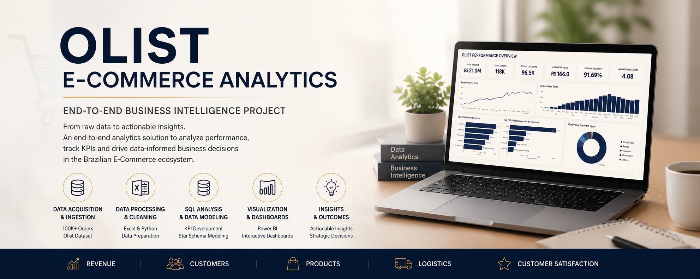

<p align="center">
  
</p>

# Olist E-Commerce Business Intelligence Case Study

An end-to-end Business Intelligence project that transforms raw e-commerce data into actionable business insights using **Excel, Python, PostgreSQL, SQL, and Power BI**.

This project demonstrates the complete analytics lifecycle, including business understanding, data preparation, data quality validation, exploratory analysis, KPI development, dashboard design, and strategic business recommendations.

---

# Overview

The Olist Brazilian E-Commerce dataset contains transactional information related to customers, orders, products, sellers, payments, reviews, and logistics.

The objective of this project is to analyze business performance, understand customer purchasing behavior, evaluate operational efficiency, and build interactive dashboards that support data-driven decision making.

Every stage of the project has been documented to demonstrate not only the technical implementation but also the analytical thinking behind each business decision.

---

# Business Problem

E-commerce businesses generate large volumes of transactional data every day. Without a structured Business Intelligence solution, it becomes difficult to answer critical business questions such as:

- Which product categories generate the highest revenue?
- Which customer segments contribute the most value?
- How efficiently are orders delivered?
- Which regions drive business growth?
- What factors influence customer satisfaction?
- Which operational improvements can increase long-term profitability?

This project addresses these challenges by developing a complete Business Intelligence solution that converts raw data into meaningful business insights.

---

# Business Objectives

The project aims to:

- Analyze overall sales performance
- Evaluate customer purchasing behavior
- Measure customer satisfaction
- Monitor delivery and operational performance
- Identify high-performing products and regions
- Develop meaningful business KPIs
- Build interactive executive dashboards
- Provide actionable business recommendations

---

# Technology Stack

| Category | Technology |
|-----------|------------|
| Spreadsheet | Microsoft Excel |
| Programming Language | Python |
| Python Libraries | Pandas, NumPy |
| Database | PostgreSQL |
| Query Language | SQL |
| Data Visualization | Power BI |
| BI Language | DAX |
| ETL | Power Query |
| Version Control | Git |
| Repository Hosting | GitHub |

---

# End-to-End Project Workflow

```text
Business Understanding
        │
        ▼
Dataset Documentation
        │
        ▼
Excel Data Preparation
        │
        ▼
Python Data Cleaning & Validation
        │
        ▼
PostgreSQL Database
        │
        ▼
SQL Analysis
        │
        ▼
Business KPI Development
        │
        ▼
Power BI Dashboard Development
        │
        ▼
Business Insights & Recommendations
```

---

# Dashboard Preview

<p align="center">
  
</p>

> Additional dashboard screenshots, workflow diagrams, data models, and supporting visuals are available in the **01_assets** directory.

---

# Key Performance Indicators

The executive dashboard tracks the following business metrics:

- Total Revenue
- Total Orders
- Total Customers
- Average Order Value
- Average Review Score
- Repeat Purchase Rate
- Delivery Success Rate
- Revenue Growth
- Category Performance
- State-wise Revenue Distribution

---

# Business Insights

The analysis identified several important business findings, including:

- Strong overall revenue performance across the reporting period.
- São Paulo contributed the highest share of total revenue.
- Health & Beauty emerged as the highest-performing product category.
- Customer satisfaction remained consistently high based on review ratings.
- Delivery performance maintained a high order completion rate.
- Customer segmentation revealed opportunities to improve repeat purchases and long-term retention.

---

# Repository Structure

```text
olist-ecommerce-bi-case-study
│
├── 01_assets
│   ├── Dashboard Screenshots
│   ├── Data Model
│   ├── Workflow Diagram
│   ├── Project Banner
│   └── README.md
│
├── 02_documentation
│   ├── 00_End_to_End_Business_Intelligence_Case_Study_Olist.pdf
│   ├── 01_Business_Documentation
│   │   ├── Business Documentation PDFs
│   │   └── README.md
│   │
│   ├── 02_Data_Dictionary
│   │   ├── Table Documentation PDFs
│   │   └── README.md
│   │
│   ├── 03_Database_Design
│   │   ├── Database Documentation PDFs
│   │   └── README.md
│   │
│   ├── 04_Python
│   │   ├── Python Documentation PDFs
│   │   └── README.md
│   │
│   ├── 05_SQL
│   │   ├── SQL Scripts
│   │   ├── SQL Documentation PDFs
│   │   └── README.md
│   │
│   ├── 06_Power_BI
│   │   ├── Dashboard Documentation PDFs
│   │   └── README.md
│   │
│   └── README.md
│
├── LICENSE
└── README.md
```
---

# Project Documentation

This repository contains comprehensive documentation covering every stage of the Business Intelligence lifecycle.

## Business Documentation

The business documentation establishes the analytical foundation of the project and includes:

- Project Charter
- Business Understanding
- Stakeholder Analysis
- Business KPIs
- MECE Framework
- Business Hypotheses
- Dataset Documentation
- Business Insights & Recommendations
- Final Report

---

## Data Dictionary

The Data Dictionary provides detailed documentation for every table used in the project, including:

- Customers
- Orders
- Order Items
- Products
- Sellers
- Payments
- Reviews
- Geolocation
- Product Category Translation

Each document explains table purpose, business relevance, key attributes, relationships, and data quality considerations.

---

## Database Design

Database documentation includes:

- Database Understanding
- Relational Schema
- Entity Relationships
- Primary Keys
- Foreign Keys
- Relationship Validation

This documentation explains how the database was structured before beginning analytical development.

---

## Python Documentation

The Python phase focuses on preparing high-quality data for downstream analysis.

Documentation includes:

- Dataset Audit
- Referential Integrity Validation
- Data Cleaning & Preprocessing
- Feature Engineering
- Exploratory Data Analysis (EDA)
- PostgreSQL Integration

---

## SQL Documentation

The SQL phase converts cleaned data into meaningful business insights through structured analysis.

Documentation includes:

- Database Fixes
- Exploratory Data Analysis
- Join Analysis
- KPI Development
- Business Analysis
- Hypothesis Testing
- Advanced SQL
- SQL Insights Summary

Each module contains both SQL query scripts and supporting documentation explaining the analytical methodology and business findings.

---

## Power BI Documentation

The Power BI phase transforms analytical outputs into interactive dashboards designed for business stakeholders.

Documentation includes:

- Dashboard Overview
- Data Model
- DAX Measures
- Dashboard Design Decisions
- Dashboard Pages
- Business Insights
- Recommendations

---

# Skills Demonstrated

This project demonstrates practical experience across multiple areas of Business Intelligence and Analytics.

### Business Analysis

- Business Problem Identification
- Stakeholder Analysis
- KPI Definition
- MECE Problem Structuring
- Hypothesis Development

### Data Preparation

- Data Cleaning
- Missing Value Analysis
- Data Validation
- Referential Integrity Checks
- Feature Engineering

### SQL & Database

- PostgreSQL
- Joins
- Aggregate Functions
- Common Table Expressions (CTEs)
- Window Functions
- Business Query Development

### Data Visualization

- Data Modeling
- DAX
- Power BI
- Dashboard Design
- KPI Reporting
- Interactive Visualizations

### Professional Practices

- Documentation
- Git & GitHub
- Repository Organization
- Business Storytelling
- End-to-End Analytics Workflow

---

# Dataset

This project uses the **Olist Brazilian E-Commerce Public Dataset**, which contains real-world transactional data collected from an e-commerce marketplace.

The dataset includes information related to:

- Customers
- Orders
- Order Items
- Products
- Sellers
- Payments
- Customer Reviews
- Geolocation
- Product Categories

The data was extensively validated, documented, and transformed before being used for SQL analysis and dashboard development.

---

# Project Highlights

- Designed and documented a complete end-to-end Business Intelligence solution using a real-world e-commerce dataset.
- Performed data cleaning, preprocessing, and feature engineering using Python.
- Validated data quality through referential integrity and consistency checks.
- Developed business-focused SQL queries to analyze customer behavior, sales performance, operational efficiency, and customer satisfaction.
- Designed an interactive Power BI dashboard with KPI tracking, DAX measures, and business-driven visualizations.
- Produced comprehensive technical and business documentation covering every phase of the project.
- Maintained a structured GitHub repository following professional documentation and version control practices.

---

# Learning Outcomes

This project provided hands-on experience across the complete Business Intelligence workflow, including:

- Business Problem Analysis
- Data Cleaning & Preparation
- Exploratory Data Analysis
- Relational Database Design
- Advanced SQL
- KPI Development
- Data Modeling
- DAX
- Dashboard Design
- Business Storytelling
- Technical Documentation
- Git & GitHub

---

# Future Enhancements

Potential improvements for future iterations include:

- Customer Segmentation using RFM Analysis
- Customer Lifetime Value (CLV) Analysis
- Sales Forecasting
- Churn Prediction
- Automated ETL Pipeline
- Incremental Data Refresh
- Interactive Web Dashboard Deployment

---

# Contact

**Pravallika Manepalli**

**Email**  
pravallika.analytics@gmail.com

**LinkedIn**  
https://www.linkedin.com/in/pravallikamanepalli/

**GitHub**  
https://github.com/Mslp18

---

# License

This project is licensed under the MIT License. See the `LICENSE` file for additional information.